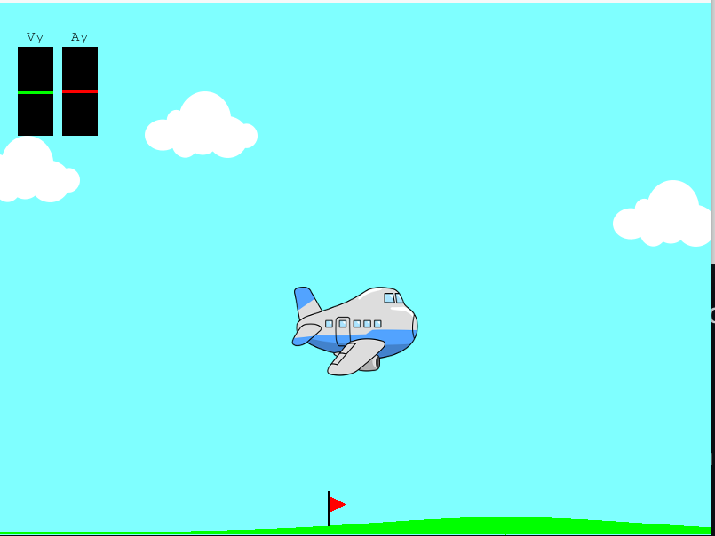
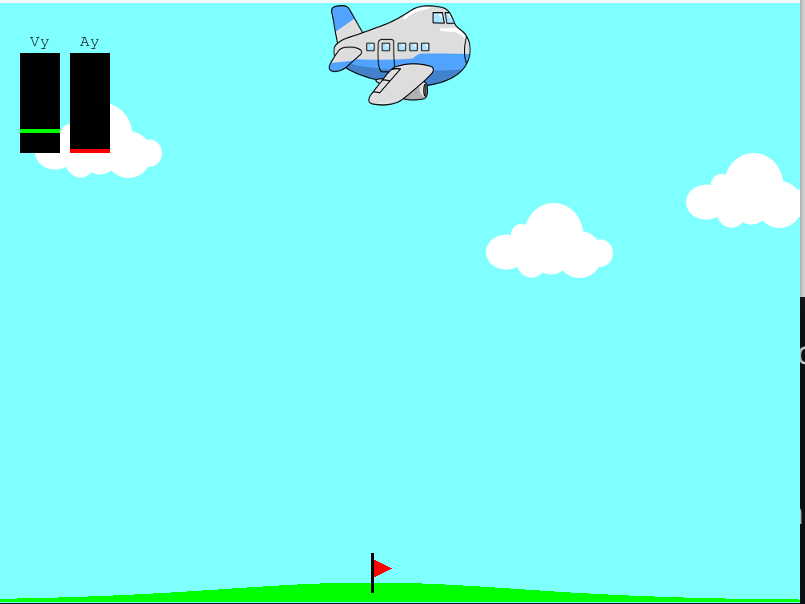
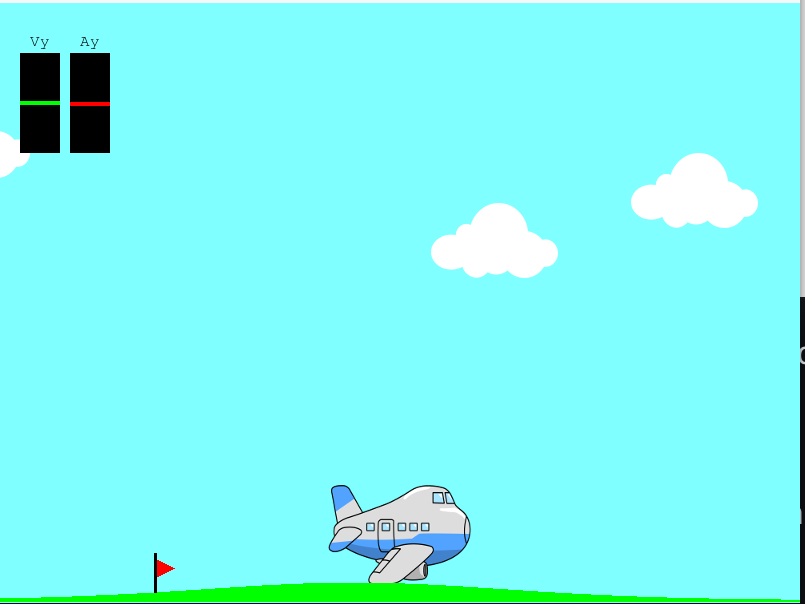

Airplane Bombing Adventure 🛩️💥
Welcome to the Airplane Bombing Adventure, a thrilling 2D airplane simulation game built with Python and Pygame! 🎮 Soar through the skies, drop bombs with precision, and chase a sneaky flag in this action-packed, physics-driven game. Ready to rule the skies? Let’s dive in! 🚀
🎉 Features That’ll Blow You Away

Manual Bombing 💣: Smash b to drop bombs that plummet to the ground in a glorious explosion!
Auto-Bombing Genius 🧙‍♂️: Press a to let the game calculate the perfect bomb drop to nail the flag. 🎯
Realistic Physics ⚡: Bombs fall, planes soar, and flags scoot—all powered by a slick physics engine.
Stunning Visuals 🌈: Watch your plane, bombs, clouds, and flag come to life in real-time.
Dynamic Gameplay 🎮: Control your plane with the mouse, drop bombs with keys, and feel the action unfold!

🏗️ Built with OOP Awesomeness
This game is a masterpiece of object-oriented programming, split into modular files for clean, scalable code. Here’s the lineup:

controller.py: Your mission control, handling inputs and game logic. 🕹️
state.py: Tracks plane altitude, bombs, and flag positions like a pro. 🧠
view.py: Paints vibrant visuals, from planes to explosions. 🎨
physics.py: Crunches physics for bomb drops and collisions. 🔬
constants.py: Stores game settings (gravity, speeds, etc.). 📜
main.py: Launches the adventure! 🚀

🎮 How to Play

Fly Your Plane:
Move your mouse to adjust altitude. Smooth and snappy! 🧈
Press b to drop bombs manually. 💥
Hit a for auto-bombing to chase that flag. 🎯

Enjoy the Show:
Watch bombs fall, clouds drift, and the flag taunt you.
Explosions light up the screen when bombs hit the ground or flag! ✨

🛠️ Getting Started

Clone the Repo:git clone https://github.com/your-username/Airplane-Bombing-Adventure.git

Install Pygame:pip install pygame

Run the Game:python main.py

Take to the Skies! 🛩️

📁 What’s in the Repo?

controller.py: Game logic and input handling.
state.py: Game state management.
view.py: Visual rendering.
physics.py: Physics calculations.
constants.py: Game constants.
main.py: Game launcher.
Assets: plane.png, bomb.png, cloud.png, explosion.png.

🤝 Contributing
Love the game? Want to make it even cooler? 🌟

Fork the repo! 🍴
Add features (sound effects, scores, enemy planes? 😈).
Submit a pull request and join the fun! 🙌
Report bugs 🐞 or share ideas 💡 in Issues or Discussions.

🚀 Why This Game Rocks
With its modular design, realistic physics, and vibrant visuals, this game is a blast to play and a joy to code. Tweak it, expand it, or just enjoy the ride—either way, you’re in for a sky-high adventure! ✈️💥
Happy flying! 🎉

